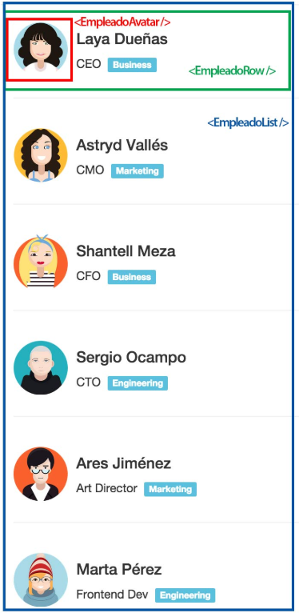

# React + Vite

This template provides a minimal setup to get React working in Vite with HMR and some ESLint rules.

## Trabajo Práctico React

### Ejercicio 7

7. Lista de empleados - Dificultad: 🟢🟡

Crear una aplicación web que permite reutilizar componentes siguiendo la estructura de la siguiente imagen, pueden incorporar bootstrap u hojas de estilo propias.



Tendremos un EmpleadoAvatar (recuadro rojo), un EmpleadoRow (recuadro verde) y por último un EmpleadoList (recuadro azul). Los datos de los empleados deberán ser mostrados mediante un arreglo que deben crear similar al siguiente:

```js
let empleados = [
  {
    id: 1,
    fullName: "Laya Dueñas",
    title: "CEO",
    department: "Business",
    pic: "empleado01.png",
  },
  {
    id: 2,
    fullName: "Astryd Vallés",
    title: "CMO",
    department: "Marketing",
    pic: "empleado02.png",
  },
  {
    id: 3,
    fullName: "Shantell Meza",
    title: "CFO",
    department: "Business",
    pic: "empleado03.png",
  },
  {
    id: 4,
    fullName: "Sergio Ocampo",
    title: "CTO",
    department: "Engineering",
    pic: "empleado04.png",
  },
  {
    id: 5,
    fullName: "Ares Jiménez",
    title: "Art Director",
    department: "Marketing",
    pic: "empleado05.png",
  },
  {
    id: 6,
    fullName: "Marta Pérez",
    title: "Frontend Dev",
    department: "Engineering",
    pic: "empleado06.png",
  },
  {
    id: 7,
    fullName: "Ellen Balderas",
    title: "Digital Strategist",
    department: "Marketing",
    pic: "empleado07.png",
  },
  {
    id: 8,
    fullName: "Cynthia Valentín",
    title: "Backend Dev",
    department: "Engineering",
    pic: "empleado08.png",
  },
  {
    id: 9,
    fullName: "Bernard Jung",
    title: "DevOps Engineer",
    department: "Engineering",
    pic: "empleado09.png",
  },
];
```

---

Utilizamos [React-Bootstrap](https://react-bootstrap.netlify.app/) **v2.9.0** en nuestro proyecto para incoroporar el Container, Form, Button, InputGroup, y usamos el **"bootstrap/dist/css/bootstrap.min.css"** para utilizar los estilos de Bootstrap.

> **IMPORTANTE:** Para ambos casos tenemos que importar estas herramientas con el **import**.

---

Utilizamos el objeto props para mandar información (string y funciones) desde los Componentes padres a los Componentes hijos.

Utilizamos un HOOK que es una función que le da habilidades extras a mi functionalComponent, una de esas es el Estado.

> 📌 useState es el nombre del Hook.

### Repositorio 💻

Los ejercicios se encuentran en el sgte. repositorio:
https://github.com/EmiTorres93/RCS-43i-React_exercise7

- Para clonar el Repositorio:

```bash
git clone https://github.com/EmiTorres93/RCS-43i-React_exercise7
```

- Para contribuir con el proyecto ponerse en contacto con el sgte. mail: **emiliana.mt93@gmail.com**

## Autores

1. Emiliana M. Torres [GitHub](https://github.com/EmiTorres93)
